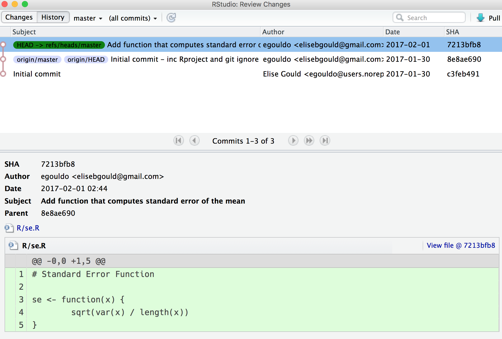
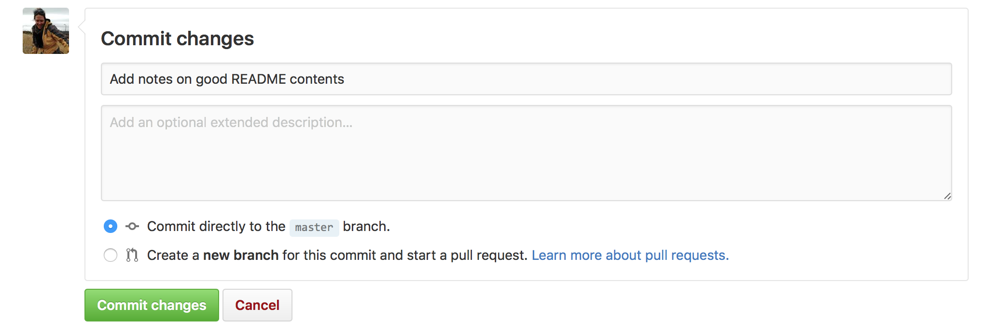

# Why version control?


As scientists we often engage in version control at one stage of a project or another, without even realising it. Usually this occurs in an informal and haphazard fashion. This often takes the form of multiple revisions of papers codes or datasets being saved duplicate copies with filenames that are uninformative (*draft_1.doc*, *draft_2.doc*, etc., Ram, 2013).

**Why you should version control:**

- When you come back to your project after a few months or a year, how do you know which version of the file is the most recent version?
- What is the difference between two different versions of a file? Which lines were changed, and how were they changed? Do you remember the rationale behind two different versions?
- What if you made changes and overwrite a file without saving it as a new document? How will you get those changes back if you want them?

A dedicated version control system (VCS) can help you address these issues. But the necessity of a VCS probably wont become apparent until you are in the throes of using it. A VCS acknowledges that there is only *one* project: i.e. everything that you are currently working on. All past versions are tucked away from your current workspace, inside your version control system. But are still accessible should you need to view them, or rollback any changes. Moreover, a version control system allows you to have a snapshot of the project at any one moment ([why use version control guide](https://www.git-tower.com/learn/git/ebook/en/command-line/basics/why-use-version-control)). Importantly a good version control system allows you to communicate the decision process of data cleaning or analysis clearly and transparently (BES, 2014). Your version control system can therefore act as a lab notebook for your code.

**Why version control with git**

Git is one such software system for implementing version control. It runs on your computer locally and works best when tracking files stored as plain text rather than binary files like word documents. Git records the changes you make to your projects files. Storing the entire history of your project locally, also called a 'repository'.

- Ability to restore previous versions of a file
- Understanding what you did and why -> everytime you save a new version of your project, git requires you to provide a short description of what was changed. If the changes occurred to a text file, including a script containing code, you can see precisely what changed within the file.
- Backup -> ALthough not strictly a backup system in its own right, git can act as a backup, especially when you use GitHub, a cloud-based storage of your project that is version-controlled under git.

# The basic git workflow:


1. Create / edit / modify a file inside your repository
2. Once happy with the changes, you `stage` them  in the staging area. You can choose to stage only some of the changes in a file, or you can stage changes in multiple files.
3. By `commit`ting those changes, git creates a permanent snapshot of the file in your project's directory. A mandatory part of the 'committing' process is writing an accompanying 'commit message' that outlines twhat you did to the file.

Once you have committed a file for the first time, it becomes 'tracked', meaning that any time you modify a file, those changes will be picked up by git, and noted in your workspace, waiting for you to choose to stage and commit those changes or discard them.

# Version Control with GitHub: gitting your work into the cloud

While git runs locally on your computer, GitHub is a commercial website that lets you store your git repository for free. There are many web clients that do this now, however GitHub is one of the friendliest to use, and most widely used.

Storing your repository in the cloud has many benefits, including but not limited to:

- Working collaboratively: different collaborators can push their changes to the GitHub repository, and pull any changes that others have made from GitHub to their local computer.
- It provides a backup of your project and the entire repository
- You can share your source code and datasets with others, in the spirit of open science.

Using GitHub in addition to running git locally on your computer requires two more additional steps to the workflow:

4. `Push`ing your changes made on your local computer to GitHub
5. If you have made any changes to the GitHub repository on the website, or else you are collaborating with others that have pushed changes to GitHub, you will need to ensure that those changes are downloaded to your computer by `pull`ing them.

## Challenge: A walkthrough with git and github in RStudio

1. Create a new R script, called `se.R`. . Write the following inside the script and save it in in the `./R/` folder because it is a function.

```{r, eval = FALSE}
se <- function(x){
        sqrt(var(x) / length(x))
}
```

2. Open up the git tab. Note that There are question marks besides the file because it is not yet known or tracked by git. 

3. When you check the box next to this file, the question marks change to an `A`, indicating that the file has been added to the stage. 
This means that we want that file to be a part of the next revision of the project...


The file has not yet been version controlled though, we have simply moved it to the staging area, indicating that we *intend* to add it to the next revision. So we have to `commit` the file.

4. hit the commit button, and you will see the review window appear


Note the green text appearing in green. This window is the 'diff' window and shows you what exact changes have occurred in the file. Green represents additions, red represents deletions.

5. Enter an informative commit message in the appropriate window. And press 'commit'

```
Add function that computes standard error of the mean
```

A log window will open up letting you know that the commit worked. You will see that the file has been removed from the current workspace in the git pane, because there are no changes that have occurred since the file was last committed.

### Viewing repository History

Click on the History tab of the Git Pane. Note the three revisions of the project, with the most recent revision occuring at the top of the list. Your Commit message is listed for each snapshot or revision. As well as the author and data of the commit. Each commit also has a SHA hash, which is a string of letters and numbers unique to every commit. Don't worry about these for now. 




*Local versus remote repositories*

Notice the green label with `HEAD -> refs/heads/master`, and the purple labels with `origin/master` and `origin/head`. The green label represents the version of the project open in Rstudio at the moment - i.e. the local version on your computer. The purple tags represent the version of the the project as they are in our remote or `origin`, i.e. the repository on GitHub.

Notice that the 'remote' version of the repository is one commit behind the local version. This is because git and GitHub don't automatically sync as do, for example, dropbox. We need to manually merge the changes between the two versions if we would like to keep them in sync. In this instance, we would keep the remote and local repositories in sync by `push`ing our local changes to GitHub, forcing the remote repository to catch up. Before we push our local changes this, we'll make one more local commit.

## Making changes

Modify the `se.R` script to:

```{r evalu = FALSE}
# Standard error function
se <- function(x)
  sqrt(var(x, na.rm=TRUE) / length(na.omit(x)))
```

The file will now appear in the git pane, with the 'M' symbol beside, representing that it has been modified.

 

Select the checkbox to stage the file, the M now moves position, indicating that it has been staged for committing. Write the following commit message, and commit the file.

```
Modify se function to ignore NA values.
```

### Pushing to GitHub

1. View the history of the file in RStudio.
2. Go to GitHub and view the repository, click on '2 commits' to view the history of the repository
3. You will see that the last two commits you just made including the addition and modification of the `se.R` file are not reflected in the repository. This is because we havent sent those changes back to GitHub yet.
4. Go back to the Git pane in RStudio, and click the `push` button. You will see another log message telling you that the changes have been pushed to the address of the GitHub repository.
5. Now go back to GitHub and view your change. Your GitHub and local repository should now be in sync.


### Pulling from GitHub

Pulling is useful when changes have been made to the online repository perhaps by someone else, or by yourself within GitHub (useful when working away from your main computer where the repository is stored).

We are going to update the README on GitHub itself.

1. Click on the README.md file in the list of files within the repository home page on GitHub.
2. Click on the pen icon to open the file editor.
3. Paste the text below into the README file.

```
# VicBioCon17 README

Welcome to your README for the GitHub repository containing your work from the Victorian Biodiversity Conference R Workshop. The README is the landing place for your repository on GitHub and is the first thing others will see when they arrive here.

A README can take on various forms, depending on the nature of your project, project maturity, and the number of collaborators or users you expect to visit your repository. README files are useful for communicating:

- What the aim of the project is
- why the project is useful
- how any users or contributors of the code in your repository can get started
- who to contact for assistance
- the structure of the the project directory and protocol for collaborating

A README should always go into the root directory of your repository. GitHub looks for this file and can automatically render this file to visitors.

## 'Rendering' README files

By saving your README file with the extension `.md`, your file is saved as a markdown file. When you created this repository in GitHub and selected the option to create a README file, GitHub automatically created the file as a markdown document: `README.md`. The code you pasted from the version control document here is written in Markdown. Markdown is a an easy to use syntax for creating stylised text on the web. When your markdown text is converted from markdown to html, this is called "rendering".

[Click here Guide to markdown here](https://guides.github.com/features/mastering-markdown/)

## Why share your project publically on GitHub?

Open Science, duh. Sharing your code and / or data publically on GitHub allows anybody to view your work, facilitating longitudinal studies, meta-analyses, or simply making a new and novel method you've been working on available for others to implement. 

Sharing your reserach data as well as your code may even boost your paper's citation stats (Piwowar et al, 2007).

A README is quintessential to having a well-documented and reproducible open repository. In addition to keeping good meta-data, sharing your work openly may facilitate new problem formulations and new frameworks in your discipline (Bonnet et al, 2012).

## References

Freire, J., Bonnet, P., & Shasha, D. (2012, May). Computational reproducibility: state-of-the-art, challenges, and database research opportunities. In Proceedings of the 2012 ACM SIGMOD international conference on management of data (pp. 593-596). ACM.

Piwowar, H. A., Day, R. S., Fridsma, D. B. (2007) Sharing Detailed Research Data Is Associated with Increased Citation Rate (ed J. Ioannidis). PLoS One. 2, e308–5.
```

4. Scroll down to the bottom of the screen. Write an informative commit message, such as: `Add notes on good README contents` Hit 'Commit changes', selecting 'commit directly to the `master` branch.



5. Hit the commit button and and return back to your repository's home page. Notice the last commit message has appeared next to the README file in the file list.

6. Return to RStudio. Remember that you need to manually suck these changes from the GitHub repository. Do so by hitting 'Pull' inside the Git pane. Your local and GitHub repositories will now be in sync.

# Git Philosophies

1. Commit Early, Commit Often. 

Making infrequent commits with numerous changes defeats the purpose of having a proper VCS. 

It is better practice to commit changes one file at a time. This ensures that you can thoroughly document your changes, keeping the your data analysis pathway transparent and clear to yoruself and to others. Secondly, commiting changes file by file, makes reverting back to previous revisions of the project a lot easier. Note that there *are* ways to do restore only part of a revision without reverting the whole project back to that state (hint: search for 'cherry-picking'), however it is tedious to do so, and better to avoid getting into this situation in the first place.

2. Good, informative commit messages

Your git repository acts much like a lab notebook or research log. Informative messages make it easy for you to pick up your project after some time away, and for collaborators to easily jump on board. Importantly, good commit messages can aid you in identifying exactly where you might need to roll back your project to if you would like to undo some changes or mistakes.


## Advanced features

### Collaborating with others

We have been running through a workflow for the solo-analyst. But there are some particular rules you need to follow for when you are working on someone else's repository. Here is a good walkthrough of this: [intro to git in RStudio, at Nice R code](http://r-bio.github.io/intro-git-rstudio/).

### Branches

Although branches are an advanced feature of git and we have not been using them here. It is worth knowing a little about what they are. 

Branching duplicates the existing repository at a particular point, and allows you to develop new features or experiment without changing the main or the `master` version or branch of the project. If you like the modifications you have made, you can merge these back into the project's `master` branch. Any time you create a new repository, a single `master` branch is created. And all your commits go here unless you explicitly create new branches.

Let us return to the screenshot of the repository history that we looked at earlier in RStudio:


Remember the purple tags represented the version of the remote repository, and the green tags represented the version of the local repository? Now we will have a look at the specific contents of each of these tags.

`master` refers to the main or master branch. i.e. the main version of the project. Any other branches represent developmental work such that you can experiment without affecting the `master` branch. Note that we only have master branches on both our local and remote repositories here.  `HEAD` is the 'current branch'. Any commits you make will go to the `HEAD` branch. When you switch branches, the `HEAD` revision will switch to the tip of that branch, and any commits will go to that branch. 

Examine the tag contents again. Notice that because our local and remote repositories only have a single, master branch, the `HEAD` tag also occurs on each `master` branch.

# References

This page has been adapted from Rich FitzJohns example [At nice R code](http://r-bio.github.io/intro-git-rstudio/)

For more information about branching, go to [GitHub's guide to branching here](https://guides.github.com/introduction/flow/).

British Ecological Society (2014) A Guide to Data Management in Ecology and Evolution. (ed K. Harrison). British Ecological Society. [online]. Available from: www.britishecologicalsociety.org/publications/journals

Gandrud, C. (2016) Reproducible Research with R and R Studio, Second Edition. CRC Press.

Ram, K. (2013) Git can facilitate greater reproducibility and increased transparency in science. Source Code Biol Med. 8, 7.


